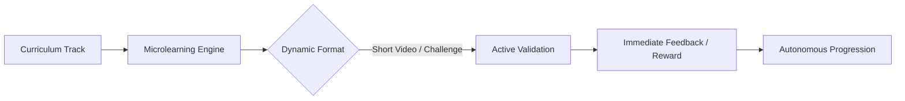
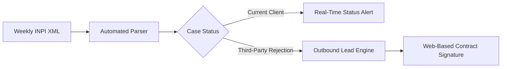

# Jônatas Crizel
### Senior Backend Architect & Behavioral Product Strategist

Translating complex business logic and human behavior into scalable, high-performance web systems. Over 20 years bridging backend engineering (PHP, MySQL, API integrations) with cognitive usability and systemic architecture.

---

## 🎯 What I Do (Core Focus)

* **Database Optimization & Refactoring:** Eliminating timeouts, redesigning query execution paths, and applying strategic indexing for relational databases under high concurrency.
* **Process Decoupling & Data Ingestion:** Breaking heavy synchronous batch jobs into resilient, staged pipelines with real-time feedback loops.
* **Product Architecture & Behavioral UX:** Designing digital workflows, onboarding engines, and transactional pipelines engineered to reduce cognitive friction and drive retention.

---

## 🛠️ Featured Architectural Case Studies

### 1. InsurTech: High-Volume Insured Group Ingestion & Real-Time Actuarial Calculation
* **Context:** Pioneering 100% digital insurance brokerage platform for civil construction, featuring proprietary actuarial engines for dynamic age tiering and policy limits.
* **Bottleneck:** Monthly mass-import operations executed synchronous calculations across tens of thousands of records, causing server timeouts, connection locks, and database deadlocks.
* **Solution:** Re-indexed composite relational keys, broke monolithic imports into staged sequential batches (*batch chunking*), and added real-time UI progress feedback.
* **Impact:** 100% elimination of timeouts, guaranteed transactional integrity, and stable monthly financial closings for brokerages.

### 2. EdTech: Gamification & Microlearning Architecture for Retention
* **Context:** Community and corporate training programs experiencing severe drop-off rates on legacy LMS software (Moodle).
* **Bottleneck:** High cognitive load driven by dense interfaces, walls of text, and absence of fast reward loops.
* **Solution:** Built a proprietary learning platform inspired by Duolingo mechanics, splitting tracks into bite-sized lessons with alternating formats and active knowledge validation.
* **Impact:** Drastic increase in voluntary module completion, sustained engagement, and autonomous student progression without manual tutor intervention.

### 3. LegalTech: Public Data Parser (National IP Office) & Commercial Funnel
* **Context:** IP/Trademark law firm tracking weekly official gazette updates manually and closing contracts via unstructured Word documents over WhatsApp.
* **Bottleneck:** High operational overhead reviewing government XML/PDF publications and high sign-up drop-off from clients struggling with document templates.
* **Solution:** Automated weekly parser for National IP Institute (INPI) XML gazettes to alert existing clients and filter unrepresented rejected filings for outbound sales. Integrated a web-based electronic contract flow and post-service NPS survey.
* **Impact:** Replaced manual monitoring with an automated pipeline and turned public patent/trademark rejections into a passive qualified inbound channel.

---

## 📂 Other Systems in Production

* **[Supply Chain ERP: Agribusiness Logistics & Freight Pricing](./cases/supply-chain-erp.md)** — Multi-warehouse inventory, fleet cost tracking, and algorithmic freight pricing eliminating operational leakage.
* **[GovTech / B2G: Public Construction Contract Tracking & Escrow Alerts](./cases/govtech-b2g.md)** — Government portal data scraping, budget measurement tracking, and contract expiration alerts for contractors.
* **[HealthTech: Clinical CRM & Electronic Health Records](./cases/healthtech-crm.md)** — Legacy data migration (Thunderbird), integrated treatment evolution notes, purchase history, and therapist agenda sync.
* **[TravelTech: Traveler Portal & Secure Document Ingestion](./cases/traveltech-portal.md)** — Multi-family booking management, private client portals, and secure passport upload/validation pipelines.

---

## 💻 Tech Stack & Core Competencies

* **Backend & Systems:** Modern PHP, OOP, MVC/Modular Architecture, MySQL Schema Optimization & Indexing, RESTful APIs, Webhooks, Batch Pipelines.
* **Product & Strategy:** End-to-End Process Mapping, Cognitive Load Reduction (Applied NLP), System Modeling with Mermaid, Unambiguous Technical Requirements Engineering.

---

## 📬 Contact & Inquiries

* **Website:** [https://nextstepup.dev](https://nextstepup.dev)
* **LinkedIn:** [linkedin.com/in/jonatascrizel](https://www.linkedin.com/in/jonatascrizel/)
* **Upwork:** *[Your Upwork Profile Link]*
* **Email:** *[Your Professional Contact Email]*