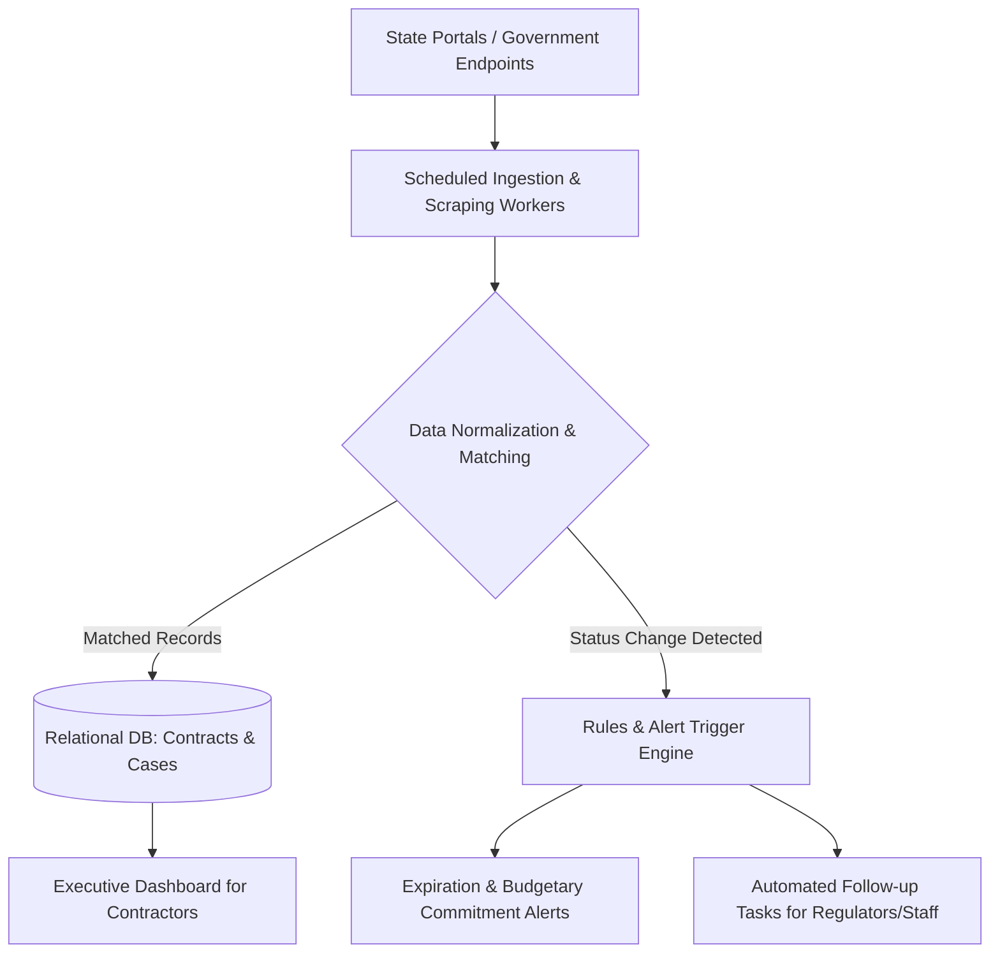

# Case Study: GovTech B2G — Public Infrastructure Contract Monitoring, Escrow Tracking & Regulatory Alerts

## 📌 Executive Summary (Business Overview)
* **Industry:** GovTech / B2G & Civil Construction Regulatory Consulting.
* **The Business Bottleneck:** A specialized regulatory consulting firm serving commercial construction contractors managed high-stakes government public works contracts through scattered email inboxes, spreadsheets, and manual portal lookups. This operational friction caused missed contract extension deadlines, measurement payment delays, and cash-flow freezes due to delayed budgetary commitments (*empenhos*).
* **The Transformation:** Engineered a centralized operations engine that automates data ingestion from government procurement portals, establishes clear relational hierarchies between contractors, contracts, and administrative cases, and enforces proactive alerts for critical contract expirations.
* **Business Impact:** Prevented costly public works stoppages caused by lapsed contracts, accelerated cash-flow collection for construction firms, and cut manual government portal review time by over 70%.

---

## 🛑 Operational Pain Points & Root Causes

1. **Government Portal Opacity:** Public procurement systems lack active event webhooks or real-time status alerts, requiring consultants to manually check dozens of state portals daily for payment certifications.
2. **High Contractual Deadlines Risk:** Public civil works contracts strictly enforce administrative deadlines; failing to renew an amendment (*aditivo*) prior to expiration terminates the agreement and halts works.
3. **Fragmented Stakeholder Communication:** Each contractor manages multiple site engineers, financial directors, and legal counsels. Updates trapped in personal emails prevented team-wide accountability and delayed responses to public audits.

---

## 🛠️ Engineering Decisions & Data Architecture

* **Automated Portal Ingestor & Parser:** Designed scheduled background workers to scrape and pull legal case progress from public agency web endpoints, normalizing raw HTML/document data into structured records.
* **Multi-Tier Relational Architecture (Contractor ➔ Contracts ➔ Proceedings):** Built normalized relational schemas linking multiple company stakeholders to contracts, binding granular inspection milestones to parent public bids.
* **Predictive SLA & Alert Engine:** Automated threshold rules (e.g., 60, 30, and 15 days out) alerting teams to pending expirations, overdue government measurements, or stalled budgetary commitments.
* **Executive Decision Dashboards:** Created an at-a-glance dashboard with urgency-based status indicators (risk-weighted priority views), allowing the firm to export actionable executive summaries directly to contractor CEOs.

---

## 📊 System Architecture Flow

---

## 💡 Key Takeaways & Process Engineering
* **Resilient Scraping Infrastructure:** When integrating with public platforms that frequently experience downtime and UI changes, retry logic, timeout safeguards, and change-detection heuristics are mandatory.
* **Exception-First UI Design:** In public contract management, executives care most about bottlenecked processes and impending deadlines. The interface was engineered to bubble up high-risk items above normal operational traffic.