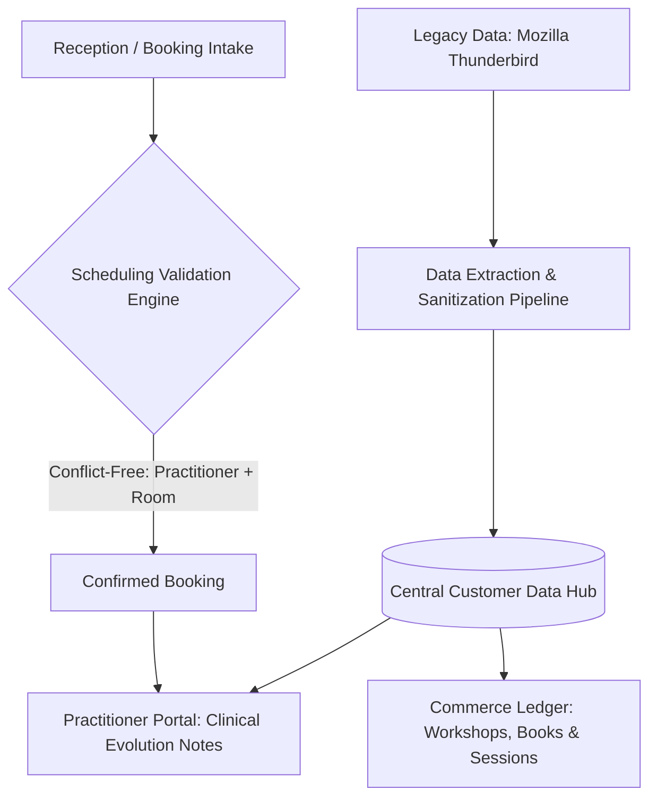

# Case Study: HealthTech CRM — Clinical Records, Scheduling Engine & Legacy Data Migration

## 📌 Executive Summary (Business Overview)
* **Industry:** HealthTech & Integrative Therapy / Personal Development Clinics.
* **The Business Bottleneck:** The clinic operated on disconnected, siloed tools: patient records and email histories were trapped inside local desktop mail clients (Mozilla Thunderbird), clinical progress notes were kept on physical paper or loose documents, and customer purchase histories (courses, therapy sessions, books) had no integration with practitioner calendars.
* **The Transformation:** Designed and built a proprietary CRM with automated data migration pipelines from Thunderbird. The system centralized electronic health records (EHR) with longitudinal progress notes, consolidated customer lifetime spending (LTV), and automated cross-practitioner scheduling.
* **Business Impact:** Delivered a 360-degree patient profile prior to every consultation, eliminated appointment double-bookings, and unlocked cross-selling opportunities between therapy clients and educational workshops.

---

## 🛑 Operational Pain Points & Root Causes

1. **Local Desktop Silos:** Customer communications and relationship records were locked inside individual workstation hard drives running Thunderbird, lacking centralized backups or team accessibility.
2. **Clinical Continuity & Compliance Risks:** Fragmented paper notes created significant risk of lost patient records and made case handoffs between different clinic practitioners nearly impossible.
3. **Absence of Customer Lifetime Value (LTV) Metrics:** Management had no way to identify whether clinical therapy patients were also attending paid workshops or purchasing educational publications.

---

## 🛠️ Engineering Decisions & Data Architecture

* **Legacy Data Parsing & Migration Engine (MBOX / Address Books):** Engineered data ingestion routines to parse, sanitize, and de-duplicate legacy contact structures into normalized relational database schemas.
* **Role-Based Electronic Health Records (EHR):** Built a privacy-first data model restricting clinical evolution notes to treating practitioners and clinical supervisors, backed by immutable audit trails.
* **Unified Commerce & Service Ledger:** Designed a centralized transactional ledger binding student enrollments, therapy bundles, and retail sales to a single unified customer profile.
* **Conflict-Free Scheduling Engine:** Engineered calendar validation logic evaluating three simultaneous constraints: practitioner availability, client schedule, and physical consultation room capacity.

---

## 📊 System Architecture Flow

---

## 💡 Key Takeaways & Process Engineering
* **Privacy-by-Design in Health Systems:** Critical requirement to decouple operational views (contact data, billing) from sensitive clinical observations (session progress, psychological evaluations).
* **Frictionless Clinical UX:** Practitioners require fast, focused note-taking flows immediately after sessions to eliminate cognitive friction and ensure digital record compliance.