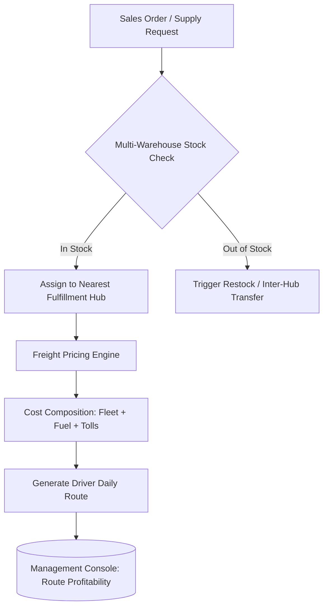

# Case Study: Agribusiness Supply Chain ERP, Fleet Telemetry & Dynamic Freight Pricing

## 📌 Executive Summary (Business Overview)
* **Industry:** Agribusiness Supply Chain & Farm Input Distribution.
* **The Business Bottleneck:** The company ran multi-million operations through disconnected Excel spreadsheets. Management lacked real-time visibility into inventory across multiple distributed storage sites and suffered consistent revenue leakage due to unbilled, miscalculated, or under-priced freight fees.
* **The Transformation:** Replaced legacy spreadsheets with an end-to-end operational ERP. The system centralized multi-warehouse stock in real time, captured granular vehicle operating expenses (fuel, tolls, maintenance), and automated margin-protective freight rate calculations on every order.
* **Business Impact:** Stopped logistical revenue leaks, eliminated negative-margin delivery runs, and provided executive clarity on fleet ROI and route profitability.

---

## 🛑 Operational Pain Points & Root Causes

1. **Fragmented Multi-Site Inventory:** Clients and suppliers maintained multiple physical facilities and farm drop-off points. Manual logs failed to confirm whether a nearby warehouse held enough stock, leading to duplicate truck dispatches.
2. **Hidden Fleet Overhead:** Maintenance, vehicle wear-and-tear, tolls, and fluctuating fuel prices were logged as general corporate overhead rather than allocated directly to route unit costs.
3. **Subjective Shipping Pricing:** Shipping prices charged to customers were estimated manually without cost verification, causing long-distance deliveries to operate at a financial loss.

---

## 🛠️ Engineering Decisions & Data Architecture

* **Multi-Location Relational Modeling:** Engineered polymorphic database entities where clients, suppliers, and internal warehouses support multiple dynamic geographic nodes tied to distribution hubs.
* **Route & Expense Aggregation Engine:** Structured travel records coupling specific trucks, drivers, and planned daily paths with variable expense ingestion (fuel receipts, tolls, maintenance logs).
* **Algorithmic Freight Engine:** Built a business-logic module that calculates accurate freight quotes based on route distance, weight/volume metrics, and fleet cost overhead prior to order confirmation.
* **Non-Blocking Inventory Accounting:** Ledger-based tracking of receipts, intra-warehouse transfers, and fulfillment logs engineered without database locking issues during high-volume dispatch hours.

---

## 📊 System Architecture Flow

---

## 💡 Key Takeaways & Process Engineering
* **Field-Ready Usability:** Systems for warehouse and dispatch teams must minimize cognitive friction with fast bulk inputs and clear visual warnings whenever profit margins turn negative.
* **Pragmatic Scope Control:** The platform targeted operational execution and profitability bottlenecks directly without unnecessary billing overhead, keeping external fiscal/tax workflows decoupled via standardized data exports.