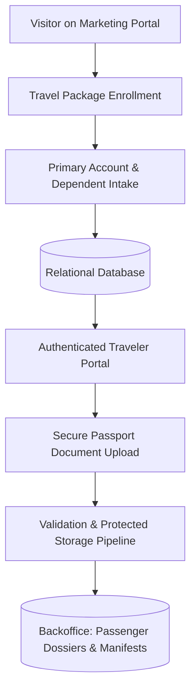

# Case Study: TravelTech — Group Travel Onboarding Portal & Secure Document Ingestion

## 📌 Executive Summary (Business Overview)
* **Industry:** TravelTech & Group Travel Operations / Historical & Educational Tours.
* **The Business Bottleneck:** The onboarding process for group travel packages relied on unstructured message threads, manual spreadsheets, and collecting sensitive traveler identity documents (scanned passports) via email and messaging apps. This led to high operational support overhead, misplaced files, and critical privacy vulnerabilities handling personal identity records.
* **The Transformation:** Designed and built an integrated web platform combining the project marketing website with a secure, authenticated traveler portal. The system enabled online enrollment with multi-dependent linking under a primary account, self-service milestone tracking, and a secure passport upload/validation engine, backed by an operations management console for flight manifests and passenger dossiers.
* **Business Impact:** Cut pre-departure operational support inquiries by over 80%, ensured compliant custody of sensitive identity documents, and empowered travelers with real-time visibility over their trip status.

---

## 🛑 Operational Pain Points & Root Causes

1. **Fragmented Multi-Family Member Registrations:** In group expeditions, a single primary traveler frequently finances and enrolls spouses and children. Managing separate records caused missing attendee links and billing confusion.
2. **Security Vulnerabilities in Document Collection:** Receiving identity scans over email or messaging platforms created data privacy liabilities and forced staff to manually download, rename, and organize hundreds of file attachments.
3. **Lack of Traveler Self-Service Visibility:** Without a dedicated authenticated portal, participants suffered travel anxiety, overwhelming coordinators with repeated inquiries regarding application and document approvals.

---

## 🛠️ Engineering Decisions & Data Architecture

* **Primary Account & Dependent Relational Modeling:** Built a hierarchical relational schema allowing one primary user profile to register, monitor, and manage multiple sub-travelers with isolated medical and dietary intake logs.
* **Secure Document Ingestion Pipeline:** Implemented protected storage workflows for scanned passport uploads, featuring strict MIME-type validation, automated sanitized naming conventions, and role-based access control preventing unauthorized URL traversal.
* **Operations Backoffice & Manifest Generation:** Built administrative control dashboards featuring group filtering, bulk document review workflows, and automated passenger manifest exports for airline block-booking and hotel check-ins.
* **Self-Service Traveler Dashboard:** Engineered an intuitive, milestone-based UI highlighting real-time compliance badges (e.g., "Passport upload pending", "Registration verified"), removing the friction of manual status inquiries.

---

## 📊 System Architecture Flow

---

## 💡 Key Takeaways & Process Engineering
* **Identity Document Privacy by Design:** International identity documents (passports) must never reside in publicly accessible web folders; secure endpoints with session-bound authorization checks are non-negotiable.
* **Cognitive Load Reduction for Family Enrollments:** Consolidating multi-traveler data intake into a unified session drastically lowers drop-off rates compared to forcing users through multiple disconnected sign-ups.